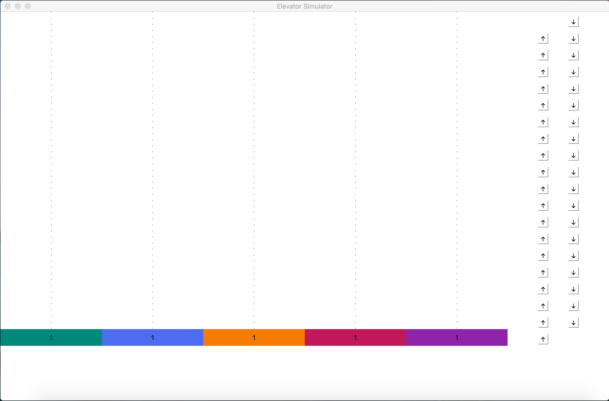
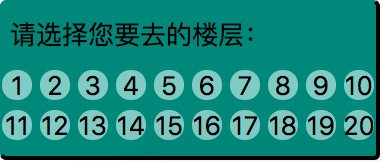

# ElevatorSimulator 使用说明

本文档：

1. 前半部分旨在帮助读者快速的上手使用`ElevatorSimulator`这个程序。
2. 后半部分对源代码中的部分类和方法进行了简单的介绍，帮助读者更容易的阅读源代码。

## 开发环境：

本程序在以下环境开发，并未在其他环境或系统下进行测试。

* macOS High Sierra Version 10.13.4
* Python 3.6.5
* PyQt5 5.10.1

## 运行程序：

1. **先进入`ElevatorSimulator.py`所在目录**（否则可能导致`stylesheet.qss`等文件无法正常加载）

   ```Shell
   cd /path/to/Elevator Simulator/
   ```

2. 运行python文件：

   ```shell
   python3 ElevatorSimulator.py
   ```

## 使用程序：

1. 按照以上步骤操作后，您应该会看到类似下面的主程序界面：

   

2.  界面右侧带有上、下箭头的按钮就是类似电梯的上行、下行按钮

3.  界面下方的五个不同颜色的矩形就是五个电梯，矩形上面的数字代表该电梯当前所在的楼层

4.  当电梯到达按下上行（下行）按钮的楼层时，界面下端会弹出类似下图所示的方框（下文称为“气泡”）：

   

5. 气泡会在一段时间后**自动消失**，来模拟真实电梯的行为。在气泡存在时，您可以选择（点击）自己要去的楼层（可多个）。（注意：如果您在**六楼**按下**上行**键，电梯到达六层并出现气泡后，您点击**五层及以下**的按钮是**无效的**）

## 对类和方法的简单介绍：

1. 类`Communication`：用来接收电梯移动的信号，并触发电梯移动的动画
2. 类`BubbleButton`：用来创建气泡中的1-20楼层按钮
3. 类`Bubble`：用来创建气泡
4. 类`Elevator`：用来创建电梯
5. 类`UpDownButton`：用来创建界面右侧的上、下行按钮
6. 类`ElevatorSimulator`：模拟电梯的主要类
7. 方法`load_qss`：加载qss文件，即类似css的`Qt Style Sheet`文件
8. 方法`paintEvent`, `draw_line`：描绘界面中的虚线
9. 方法`create_elevator`, `create_bubble`, `create_up_down_button`：创建电梯、气泡和上、下行按钮的UI
10. 方法`up_down_pressed`：上、下行按钮按下后触发的函数
11. 方法`ele_animation_finished`, `down_finished`：电梯运动动画一次结束后，气泡向下动画结束后触发的函数
12. 方法`bubble_animation`, `bubble_down`：气泡向上、向下运动动画的调用函数


